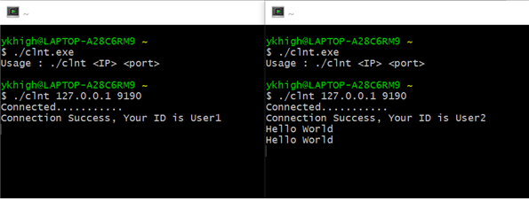
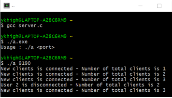
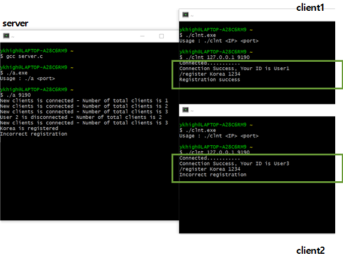
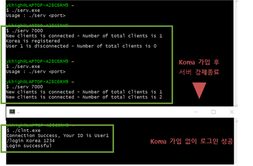
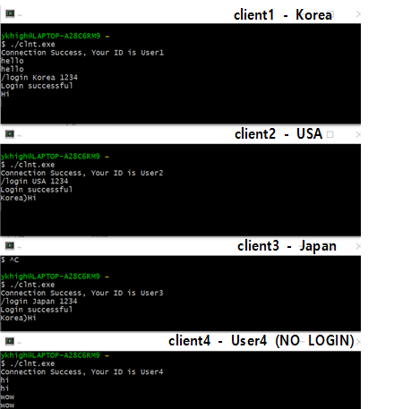
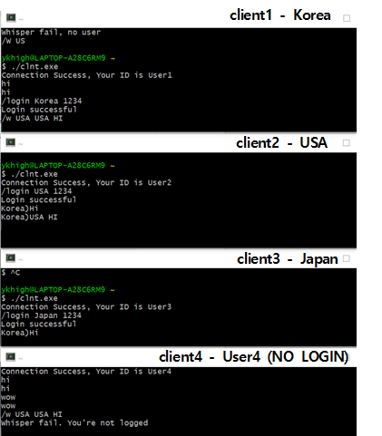
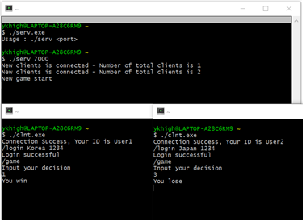

# Chatting Program with Game function using socket programming

## Client_handle
**Server gives an ID every time a client is connected**

## Client connect control
**Whenever a new client is connected, the number of clients currently connected to the server is displayed**

## Signup
**The client registers as a member by entering ID, name and password**

## Login
**Login with ID and password**

## Group Chat

## Direct Message(DM)
**Logged-in user A whispers to logged-in user B**

## Game
**Rock Paper Scissors game**

